# Complete Antigravity Environment & Capability Audit

An end-to-end technical discovery and capabilities breakdown of the **Google Antigravity AI Agent** operating environment, toolset, runtime, subagent framework, and external API accessibility.


---

## 1. Operating System & Hardware Specifications

| Component | Specification / Discovery |
| :--- | :--- |
| **OS Distro** | Ubuntu 24.04.4 LTS (Noble Numbat) |
| **Kernel** | `Linux repl 6.18.44 #Replit-Linux SMP x86_64` |
| **CPU Architecture** | 4-Core `Intel(R) Xeon(R) Platinum 8581C CPU @ 2.30GHz` |
| **Memory (RAM)** | **7.8 GB** Total (5.0 GB Available, 0B Swap) |
| **Storage Partitions** | • `/home/runner/workspace` (Workspace: 32 GB, 30 GB free)<br>• `/nix/store` (Nix Store: 256 GB, 253 GB free)<br>• `/mnt/snix` (Snix volume: 1.8 TB) |
| **User Context** | User: `runner` (UID `1000`), execution within Replit sandbox container |

---

## 2. Runtime Toolchain & Software Stack

The environment includes pre-configured runtimes, compilers, package managers, and binaries:

### JavaScript / TypeScript Runtime
* **Bun**: `v1.3.6` *(Primary runtime & fast package manager)*
* **Node.js**: `v20.20.0`
* **Package Managers**: `npm`, `npx`, `yarn` (1.22.22), `pnpm` (10.26.1)

### Python Ecosystem
* **Python**: `v3.13.4` (with GCC 14.2.1)
* **Standard Libraries**: Full standard library including `asyncio`, `urllib`, `sqlite3`, `subprocess`, `json`, `math`, `http.client`.

### System Utilities & Tools
* **Package Management**: **Nix** (`Determinate Nix 3.11.2 / 2.31.1`) allowing on-demand system package installation.
* **Browser Automation**: **Headless Chromium** (`Playwright Chromium 1.55.0` with CJK fonts installed at `/nix/store/...-playwright-browsers-1.55.0-with-cjk/chromium-1187/chrome-linux/chrome`).
* **Version Control & GitHub**: `git`, `gh` (GitHub CLI v2.88.1).
* **Text & Data Processing**: `curl`, `wget`, `jq`, `rg` (ripgrep v14.1.1), `sed`, `awk`, `find`, `tar`, `gzip`, `unzip`.
* **Containerization**: `docker` CLI binary present.

---

## 3. Native Agent Tool Matrix

The agent is equipped with native tools covering file manipulation, shell execution, subagent orchestration, image generation, web research, task scheduling, and user interactions.

```mermaid
graph TD
    Agent[Antigravity AI Agent] --> Shell[Shell & Execution]
    Agent --> Files[File & Code Management]
    Agent --> Media[Generative Media & Web]
    Agent --> Subagents[Subagent Cluster]
    Agent --> Tasks[Scheduling & Tasks]
    Agent --> Interactive[User Interactivity]

    Shell --> run_command[run_command]
    Files --> view_file[view_file]
    Files --> replace_file_content[replace_file_content]
    Files --> multi_replace_file_content[multi_replace_file_content]
    Files --> write_to_file[write_to_file]
    Files --> list_dir[list_dir]
    Files --> grep_search[grep_search]

    Media --> generate_image[generate_image]
    Media --> search_web[search_web]
    Media --> read_url_content[read_url_content]

    Subagents --> define_subagent[define_subagent]
    Subagents --> invoke_subagent[invoke_subagent]
    Subagents --> manage_subagents[manage_subagents]
    Subagents --> send_message[send_message]

    Tasks --> schedule[schedule]
    Tasks --> manage_task[manage_task]

    Interactive --> ask_question[ask_question]
```



### Tool Descriptions & Parameters

| Tool | Capabilities & Parameters |
| :--- | :--- |
| **`run_command`** | Executes Bash commands in Linux environment. Supports persistent shell state across calls via `RunPersistent` + `RequestedTerminalID`, custom async wait time via `WaitMsBeforeAsync`. |
| **`view_file`** | Reads text files (1-indexed lines, up to 800 lines/46KB slice with `ContentOffset`), as well as binary files (Images, PDFs, Videos, Audio). |
| **`replace_file_content`** | Single contiguous block edit in existing files with line-range targeting. |
| **`multi_replace_file_content`** | Multi-chunk non-contiguous edits across a file in a single tool call. |
| **`write_to_file`** | Creates new files or overwrites existing files, auto-creates parent directories, and accepts `ArtifactMetadata`. |
| **`list_dir`** | Lists contents of directories, file sizes, and recursive child counts. |
| **`grep_search`** | High-performance exact pattern or regex matching powered by ripgrep (`rg`). |
| **`schedule`** | Schedules **one-shot timers** (`DurationSeconds`, with early termination `TimerCondition` `'never'`, `'any'`, or specific sender ID) OR **recurring cron jobs** (`CronExpression` 5-field cron syntax, `MaxIterations`). |
| **`manage_task`** | Controls background processes: `list`, `status`, `send_input` (send stdin), or `kill`. |
| **`define_subagent`** | Dynamically registers new subagent types with custom names, system prompts, descriptions, and tool privileges. |
| **`invoke_subagent`** | Spawns background subagents with designated roles, workspace isolation modes (`inherit`, `branch` for git isolated branches, `share` for git worktrees), and model choices (`inherit`, `flash_lite`, `flash`, `pro`). |
| **`manage_subagents`** | Controls subagent lifecycle: `list` (returns conversation ID and live state `running`, `idle`, `waiting_for_input`), `kill`, or `kill_all`. |
| **`send_message`** | Direct inter-agent communication using conversation IDs. |
| **`generate_image`** | Generates or edits visual UI designs, diagrams, and assets using AI image models in standard aspect ratios (`1:1`, `16:9`, `9:16`, `4:3`, `3:4`, `2:3`, `3:2`). |
| **`search_web`** | Real-time web search for documentation, packages, news, and domain-targeted research. |
| **`read_url_content`** | Headless HTTP client fetching web page content and converting HTML into clean Markdown. |
| **`ask_question`** | Interactive UI modal prompting the user with single/multiple choice options and write-in text inputs. |

---

## 4. Network & Outbound API Accessibility

> [!NOTE]
> Outbound internet connectivity is active and unfiltered for standard HTTP/HTTPS calls.

### Confirmed Accessible Services & Endpoints
* **Public Web & Search**: Fully accessible (`search_web`, `read_url_content`).
* **Git & Code Hosts**: GitHub API (`api.github.com`), GitLab, Bitbucket.
* **Package Registries**: npm (`registry.npmjs.org`), PyPI (`pypi.org`).
* **Platform APIs**:
  * **Base44 API** (`base44-api.ts`)
  * **Rocket.new API** (`rocket-api.ts`)
  * **Floot API** (`floot-api.ts`)
  * **Zite API** (`zite-api.ts`)
* **Custom Webhooks & REST Services**: Can invoke any external HTTP REST or GraphQL API using `curl`, `bun`, `fetch`, or `python`.
* **Local Web Servers**: Can start background servers (`npm run dev`, Vite, Express, Bun HTTP) listening on local ports.

---

## 5. Subagent & Parallel Architecture

Antigravity features a multi-agent orchestration architecture:

```carousel
### Workspace Isolation Modes
- **`inherit`** (Default): Shares the active parent workspace directory.
- **`branch`**: Creates an isolated git branch workspace for experimental work.
- **`share`**: Creates a shared git worktree allowing parallel branching without duplicating disk storage.
<!-- slide -->
### Model Tier Hierarchy
- **`inherit`**: Inherits the parent agent's model context.
- **`pro`**: High-reasoning model for complex architecture, deep debugging, and multi-step planning.
- **`flash`**: Balanced model for general research, file edits, and search tasks.
- **`flash_lite`**: High-speed, lightweight model for rapid lookups and simple operations.
<!-- slide -->
### Reactive Event Loop
- Subagents run asynchronously in background execution threads.
- **No polling required**: The system uses reactive wakeups to notify the parent agent as soon as a subagent finishes or sends a message.
```

---

## 6. Customization System & Progressive Disclosure

The environment supports a 5-layer customization architecture:

1. **Rules** (`AGENTS.md`, `GEMINI.md`): Contextual rules loaded hierarchically.
2. **Skills** (`skills/<name>/SKILL.md`): Step-by-step operational workflows loaded on-demand via **progressive disclosure**.
3. **Plugins** (`plugins/<name>/plugin.json`): Bundles of skills, rules, and configurations.
4. **Hooks** (`hooks.json`): Lifecycle hooks executing scripts pre/post tool calls.
5. **MCP Servers** (`mcp_config.json`): Model Context Protocol integration for external tools.

---

## 7. Interactive UI & Slash Command Integration

### Available User Slash Commands
* **`/goal`**: Long-running thorough task mode.
* **`/schedule`**: Automated recurring cron or timer configuration.
* **`/plan`**: Structured step-by-step plan generation.
* **`/grill-me`**: Interactive interview to align on design decisions.
* **`/teamwork-preview`**: Multi-agent team orchestration preview.
* **`/learn`**: Behavior learning and persistence for future sessions.

---

## 8. Current Workspace Context (`Push44`)

> [!IMPORTANT]
> **Project Rules (`AGENTS.md`)**:
> 1. **No backend files in `server/`**: Path `**/server/**` is blocked by build configuration.
> 2. **SSR Hydration safety**: No top-level `Date`, `Math.random()`, or `localStorage` during render.
> 3. **Static assets**: Must be imported as ES modules from `src/assets/`.
> 4. **Package Manager**: Use `bun` exclusively (never `npm` or `yarn`).
> 5. **Zero Backend**: All credentials stay in browser `localStorage`.

---

## Summary of Operational Capabilities

1. **Full Linux Terminal Control**: Run standard Linux CLI commands, compile code, execute scripts, and install Nix packages.
2. **Multi-Agent Orchestration**: Define, launch, message, and coordinate teams of specialized subagents concurrently.
3. **Background Scheduling**: Schedule exact one-time timers or recurring cron tasks.
4. **Visual UI Design & Asset Generation**: Generate visual UI mockups, diagrams, and assets via AI image generation.
5. **Headless Web Browsing & Automation**: Run headless Chromium via Playwright or fetch/scrape web content.
6. **Web Research & API Integration**: Search the live web, fetch documentation, and interact with external APIs.
7. **Rich User Experience**: Render structured Markdown, interactive multi-choice modals (`ask_question`), Mermaid flowcharts, alerts, code diffs, and multi-slide carousels.
