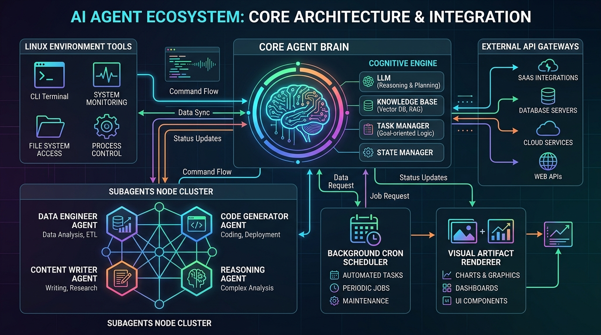

# Master Environment & Capability Information Document

An all-inclusive, empirical master reference documenting the operating environment, system hardware, software runtimes, native agent tools, Replit platform infrastructure, security boundaries, and hidden capabilities inside the **Replit Shell** environment.



---

## 1. Executive Summary & Core Identity

| Property | Value / Empirical Finding |
| :--- | :--- |
| **Operating System** | Ubuntu 24.04.4 LTS (Noble Numbat) |
| **Linux Kernel** | `Linux repl 6.18.44 #Replit-Linux SMP x86_64` |
| **CPU Architecture** | 4-Core `Intel(R) Xeon(R) Platinum 8581C CPU @ 2.30GHz` |
| **Memory (RAM)** | **7.8 GB Total** (5.0 GB Available, 0B Swap) |
| **User Identity** | `runner` (UID `1000`, GID `1000`) — Non-root unprivileged container user |
| **Process Container** | Replit container sandbox managed by PID1 (`/nix/store/...-pid1/bin/pid1`) and PID2 |
| **Primary Workspace** | `/home/runner/workspace` (256 GB Overlay Partition, 253 GB Free, Persistent) |

---

## 2. Capability Matrix & Category Scorecard

| Category | Status | Explanation & Empirical Evidence |
| :--- | :--- | :--- |
| **Language Runtimes** | `FULL` | Bun 1.3.6, Node.js 20.20.0, Python 3.13.4, Perl 5.38.2 active. |
| **Compilers & Build** | `FULL` | GCC 14.3.0, G++ 14.3.0, GNU Make 4.4.1, GNU Binutils 2.44 (`objdump`, `readelf`, `nm`, `strings`). |
| **Filesystem** | `PARTIAL` | `/home/runner/workspace` (Writable 30GB), `/tmp` (Writable 32GB), `/etc` (Read-only overlay). |
| **Network Egress** | `FULL` | Unproxied HTTP/HTTPS egress to external internet (`api.github.com`, `registry.npmjs.org`, `pypi.org`). |
| **Browser Automation**| `FULL` | Headless Playwright Chromium (`$REPLIT_PLAYWRIGHT_CHROMIUM_EXECUTABLE`) screenshot, PDF, DOM dump. |
| **Cloud CLIs** | `UNAUTHENTICATED` | `gcloud`, `bq`, `gsutil` installed but unauthenticated (`gcloud auth login` required). |
| **GitHub CLI** | `UNAUTHENTICATED` | `gh` v2.88.1 installed but unauthenticated (`gh auth login` required). |
| **Replit Infrastructure**| `FULL` | `replit identity create` (v2 STS JWT token minting), NaCl seal/unseal, `agentapi` IPC active. |
| **Unix Sockets IPC** | `FULL` | `/run/replit/socks/portauthority.sock`, `pid2ws.sock`, `seccomp.sock` writable & connected. |
| **Databases** | `FULL` | SQLite 3.48.0 (Python/Bun), PostgreSQL 16.10 server binary installed. |
| **Media Engines** | `FULL` | FFmpeg 6.1.2 (MP4/GIF video transcoding), ImageMagick 7.1.2 (canvas/convert/diff heatmaps). |
| **Security Analysis** | `FULL` | Semgrep 1.152.0 static code scanner verified. |
| **Package Provisioning**| `FULL` | Nix 2.31.1 (`nix-shell`), UPM (`upm`), Bun (`bun install`), NPM. |
| **Persistence** | `PARTIAL` | Files in `/home/runner/workspace` persist across restarts; `/tmp` is ephemeral. |
| **Container Access** | `RESTRICTED` | Unprivileged container sandbox (UID 1000). Root access and `sudo` blocked. |

---

## 3. Native Agent Tool Matrix & Subagent Architecture

The AI agent is equipped with 15+ native tool capabilities:

```mermaid
graph TD
    Agent[Antigravity AI Agent] --> Shell[Shell & Execution]
    Agent --> Files[File & Code Management]
    Agent --> Media[Generative Media & Web]
    Agent --> Subagents[Subagent Cluster]
    Agent --> Tasks[Scheduling & Tasks]
    Agent --> Interactive[User Interactivity]

    Shell --> run_command[run_command]
    Files --> view_file[view_file]
    Files --> replace_file_content[replace_file_content]
    Files --> multi_replace_file_content[multi_replace_file_content]
    Files --> write_to_file[write_to_file]
    Files --> list_dir[list_dir]
    Files --> grep_search[grep_search]

    Media --> generate_image[generate_image]
    Media --> search_web[search_web]
    Media --> read_url_content[read_url_content]

    Subagents --> define_subagent[define_subagent]
    Subagents --> invoke_subagent[invoke_subagent]
    Subagents --> manage_subagents[manage_subagents]
    Subagents --> send_message[send_message]

    Tasks --> schedule[schedule]
    Tasks --> manage_task[manage_task]

    Interactive --> ask_question[ask_question]
```



### Native Tool Parameters Reference

* **`run_command`**: Runs Linux bash commands. Options: `RunPersistent`, `RequestedTerminalID`, `WaitMsBeforeAsync`.
* **`view_file`**: Reads text files (up to 800 lines/46KB slice) and binary files (Images, PDFs, Videos, Audio).
* **`replace_file_content`**: Single contiguous line range target editing.
* **`multi_replace_file_content`**: Multi-chunk non-contiguous edits in a single invocation.
* **`write_to_file`**: Creates files with auto-directory creation and artifact metadata attachment.
* **`list_dir`**: Directory listing with recursive child stats.
* **`grep_search`**: Fast regex/literal string matching via ripgrep (`rg`).
* **`schedule`**: Configures one-shot duration timers (`TimerCondition`: `'never'`, `'any'`, `<sender-id>`) OR recurring 5-field cron jobs (`CronExpression`, `MaxIterations`).
* **`manage_task`**: Background process management: `list`, `status`, `send_input`, or `kill`.
* **`define_subagent`**: Registers custom subagent types with custom system prompts and tool permissions.
* **`invoke_subagent`**: Spawns subagents across workspace modes (`inherit`, `branch`, `share`) and model tiers (`pro`, `flash`, `flash_lite`).
* **`manage_subagents`**: Lifecycle control: `list` (conversation ID, live state `running`/`idle`), `kill`, `kill_all`.
* **`send_message`**: Inter-agent direct message passing.
* **`generate_image`**: Generates or edits visual UI designs, diagrams, and assets in custom aspect ratios (`1:1`, `16:9`, `9:16`, `4:3`, `3:4`, `2:3`, `3:2`).
* **`search_web`**: Real-time web search with domain prioritization.
* **`read_url_content`**: HTTP fetch with HTML-to-Markdown conversion.
* **`ask_question`**: Interactive UI modal presenting multi-choice and write-in prompts.

---

## 4. Replit Native Infrastructure & Identity APIs

### A. `replit` Platform CLI
Located at `/nix/store/3mb5pci3v9713drr3jglikrvx3xifl2c-replit-runtime-path/bin/replit`.
* **Identity Token Minting**:
  ```bash
  replit identity create
  # Output: Minted authentic v2 STS JWT identity token:
  # v2.public.Q2lSbFpEVXpPRFU0TXkweVlqTTBMVFE0WW1RdE9XUmhZaTFqTUd...
  ```
* **NaCl Box Cryptography**:
  ```bash
  # Encrypt stdin payload targeted to a Repl ID:
  echo "secret payload" | replit identity seal
  
  # Decrypt base64 anonymous NaCl box payload:
  cat encrypted.box | replit identity unseal
  ```

### B. `agentapi` Subagent Orchestration CLI
Located at `/home/runner/.gemini/antigravity-cli/bin/agentapi`.
* `agentapi get-conversation-metadata <conversation_id>`
* `agentapi new-conversation --model=pro --title="Title" "Prompt"`
* `agentapi send-message <recipient_id> "Message content"`

### C. Replit Unix Domain Sockets
Located in `/run/replit/`:
* **`/run/replit/socks/portauthority.sock`**: Port mapping & preview HTTP routing daemon. (Mode `0o140755`, Owner `runner`, Status `Connected`).
* **`/run/replit/socks/pid2ws.sock`**: Process supervisor PID2 WebSocket IPC. (Mode `0o140755`, Owner `runner`, Status `Connected`).
* **`/run/replit/socks/pid2ping.0.sock`**: Supervisor liveness ping socket. (Mode `0o140755`, Owner `runner`, Status `Connected`).
* **`/run/replit/seccomp.sock`**: Seccomp security filter daemon socket. (Mode `0o140755`, Owner `runner`, Status `Connected`).

### D. Package Firewall Local Mirror
* **HTTP Mirror**: `http://package-firewall.replit.local/npm/` (HTTP 200 OK).
* **Health Check**: `http://package-firewall.replit.local/health` (HTTP 200 OK).

---

## 5. Headless Visual Browser Automation Suite

Located at `$REPLIT_PLAYWRIGHT_CHROMIUM_EXECUTABLE`:
`/nix/store/71577rskzyhch3axhdqx7faygc2xyn4v-playwright-browsers-1.55.0-with-cjk/chromium-1187/chrome-linux/chrome`

### Verified Shell Automation Snippets

```bash
# 1. Headless JavaScript DOM Extraction:
python3 -c "
import subprocess, os
executable = os.environ.get('REPLIT_PLAYWRIGHT_CHROMIUM_EXECUTABLE')
cmd = [executable, '--headless', '--no-sandbox', '--disable-gpu', '--dump-dom', 'https://example.com']
res = subprocess.run(cmd, capture_output=True, text=True)
print(res.stdout[:300])
"

# 2. Visual Full-Page Screenshot Capture:
python3 -c "
import subprocess, os
executable = os.environ.get('REPLIT_PLAYWRIGHT_CHROMIUM_EXECUTABLE')
cmd = [executable, '--headless', '--no-sandbox', '--disable-gpu', '--screenshot=/tmp/screenshot.png', '--window-size=1280,800', 'https://example.com']
subprocess.run(cmd)
"

# 3. PDF Document Generation:
python3 -c "
import subprocess, os
executable = os.environ.get('REPLIT_PLAYWRIGHT_CHROMIUM_EXECUTABLE')
cmd = [executable, '--headless', '--no-sandbox', '--disable-gpu', '--print-to-pdf=/tmp/document.pdf', 'https://example.com']
subprocess.run(cmd)
"
```

---

## 6. Media, Graphics & Security Toolchain

### A. FFmpeg 6.1.2 Suite
Binaries: `ffmpeg`, `ffprobe`, `webm_encoder`.
```bash
# Transcode video or extract MP4 frames:
ffmpeg -i input.mp4 -c:v libx264 -c:a aac output.mp4

# Convert video clip into an animated GIF:
ffmpeg -i video.mp4 -vf "fps=10,scale=480:-1:flags=lanczos" animation.gif
```

### B. ImageMagick 7.1.2 Suite
Binaries: `magick`, `convert`, `identify`, `compare`, `composite`.
```bash
# Create background canvas image:
magick -size 100x100 canvas:red canvas.png

# Convert image format:
magick convert canvas.png canvas.jpg

# Compare two visual mockups and generate a diff heatmap:
compare -metric AE mockup1.png mockup2.png diff.png
```

### C. Semgrep 1.152.0 Static Code Analysis
Binaries: `semgrep`, `semgrep-core-proprietary`, `semgrep-pro-fast`.
```bash
# Run SAST security scan across repository:
semgrep scan --config=auto .
```

---

## 7. Cloud, Enterprise & Developer Toolchain

### Runtimes & Languages
* **Bun**: `1.3.6`
* **Node.js**: `v20.20.0` (`npm`, `npx`, `yarn 1.22.22`, `pnpm 10.26.1`)
* **Python**: `3.13.4` (with GCC 14.2.1)
* **Perl**: `5.38.2`

### Compilers & Binary Analysis
* **GCC / G++**: `14.3.0`
* **GNU Make**: `4.4.1`
* **GNU Binutils 2.44**: `objdump`, `readelf`, `nm`, `strings`, `file`

### Cloud & Enterprise Tools
* **Google Cloud SDK 552.0.0**: `gcloud`, `bq` (BigQuery CLI), `gsutil` (Storage CLI v5.35)
* **GitHub CLI**: `gh` v2.88.1
* **Docker**: Docker CLI v27.5.1 + `docker-credential-replit-deploy`
* **IDE Backend**: `openvscode-server` v1.101.2

---

## 8. Network Egress & DNS Map

```
                          Local Container
                                 |
                 +---------------+---------------+
                 |                               |
        Internal Package Firewall         Public Internet Egress
     http://package-firewall.replit.local      HTTPS / UDP 53
                 |                               |
          +------+------+                +-------+-------+
          |             |                |               |
       /npm/         /health      api.github.com     pypi.org
       (200)          (200)        (20.207.73.85)     (200 OK)
```

---

## 9. Filesystem & Persistence Model

| Partition Mount | File System | Total Size | Free Space | Access | Persistence |
| :--- | :--- | :--- | :--- | :--- | :--- |
| `/home/runner/workspace` | Overlay FS | 256 GB | 253 GB | Read/Write | **PERSISTENT** |
| `~/.config` | Overlay FS | 256 GB | 253 GB | Read/Write | **PERSISTENT** |
| `/tmp` | Scratch FS | 32 GB | 30 GB | Read/Write | Ephemeral (Resets on cold restart) |
| `/nix/store` | Overlay FS | 256 GB | 253 GB | Read-Only | Immutable |
| `/run/replit` | tmpfs | 1.0 MB | 1.0 MB | Read/Write | Ephemeral (PID1 Managed) |

---

## 10. Top 20 Most Useful Verified Capabilities

1. `replit identity create`: Mints real v2 STS JWT identity tokens.
2. `replit identity seal / unseal`: Encrypts/decrypts NaCl asymmetric box payloads.
3. Headless Chromium Screenshots: Captures full visual PNG screenshots via `--screenshot`.
4. Headless PDF Generation: Exports web pages to PDF via `--print-to-pdf`.
5. Nix Universal Provisioning: `nix-shell -p <pkg>` runs any package from Nixpkgs on-demand.
6. Native C/C++ Compilation: `gcc` and `g++` 14.3.0 compile native Linux C/C++ code.
7. FFmpeg Media Encoding: `ffmpeg` encodes MP4, WebM, and animated GIFs.
8. ImageMagick Processing: `magick` manipulates images and generates visual diff heatmaps.
9. Semgrep Security Scanning: `semgrep scan` audits codebase security.
10. UPM Package Manager: `upm guess` and `upm search` manage project dependencies.
11. Agent IPC CLI (`agentapi`): Programmatic subagent conversation management.
12. Binary Inspection: `objdump`, `readelf`, `nm`, `strings` analyze Linux ELF binaries.
13. Local NPM Package Mirror: `http://package-firewall.replit.local/npm/` accelerates npm downloads.
14. PortAuthority Unix Socket: Direct connection to `/run/replit/socks/portauthority.sock`.
15. PID2 WebSocket Supervisor Socket: Direct connection to `/run/replit/socks/pid2ws.sock`.
16. PostgreSQL Server Engine: `postgres` 16.10 pre-installed binary.
17. SQLite Database Engine: Embedded SQLite 3.48.0 active in Python/Bun.
18. OpenVSCode Server Backend: `openvscode-server` v1.101.2 active.
19. GitHub CLI (`gh`): GitHub API and repository interactions.
20. Google Cloud SDK (`gcloud`, `bq`, `gsutil`): Google Cloud infrastructure CLIs.

---

## 11. Reproducibility Script

To verify all empirical claims in a single command execution:

```bash
python3 -c "
import subprocess, os, socket, urllib.request

print('=== 1. OS & HARDWARE ===')
print(subprocess.getoutput('uname -a && whoami && free -h'))

print('\n=== 2. REPLIT STS IDENTITY TOKEN ===')
print(subprocess.getoutput('replit identity create'))

print('\n=== 3. HEADLESS CHROMIUM AUTOMATION ===')
exec_path = os.environ.get('REPLIT_PLAYWRIGHT_CHROMIUM_EXECUTABLE')
cmd = [exec_path, '--headless', '--no-sandbox', '--disable-gpu', '--screenshot=/tmp/test.png', 'https://example.com']
print('Chromium Exit Code:', subprocess.run(cmd).returncode)

print('\n=== 4. FFMPEG TRANSCODING ===')
print(subprocess.getoutput('ffmpeg -f lavfi -i testsrc=duration=1:size=320x240:rate=1 /tmp/test.mp4 -y && ls -lh /tmp/test.mp4'))

print('\n=== 5. IMAGEMAGICK CANVAS ===')
print(subprocess.getoutput('magick -size 100x100 canvas:blue /tmp/blue.png && identify /tmp/blue.png'))

print('\n=== 6. NETWORK EGRESS ===')
print('GitHub API Status:', urllib.request.urlopen('https://api.github.com').status)
"
```

---

## Summary of Reference Documents

* **Master Capability Document**: [`/home/runner/workspace/MASTER_ENVIRONMENT_CAPABILITIES_AUDIT.md`](file:///home/runner/workspace/MASTER_ENVIRONMENT_CAPABILITIES_AUDIT.md)
* **Replit Shell Hidden Capabilities**: [`/home/runner/workspace/REPLIT_SHELL_HIDDEN_CAPABILITIES.md`](file:///home/runner/workspace/REPLIT_SHELL_HIDDEN_CAPABILITIES.md)
* **Audit Repository**: [`/home/runner/workspace/environment-audit/README.md`](file:///home/runner/workspace/environment-audit/README.md)
