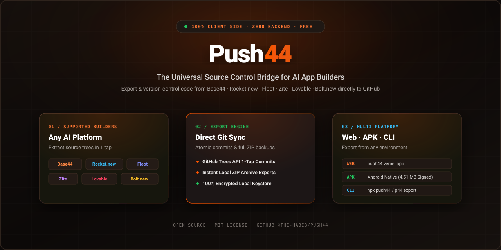

<div align="center">

<p align="center">
  
</p>

# Push44 &amp; Push44 CLI

### Version-control your AI-built apps to GitHub — in one tap or one terminal command.

**The universal bridge between AI app builders and real source control.**  
Available as a **Zero-Install Web App**, **Native Android APK**, and a **Developer CLI (`p44`)**.  
Supports Base44 · Rocket.new · Floot · Zite · Bolt.new · Lovable.dev

<br/>

[](https://push44.vercel.app)
&nbsp;
[-22c55e?style=for-the-badge&logo=android&logoColor=white)](https://push44.vercel.app/Push44-release.apk)
&nbsp;
[](https://github.com/The-habib/Push44/tree/main/cli)
&nbsp;
[](./LICENSE)
&nbsp;
[](https://github.com/The-habib/Push44/pulls)

<br/>

[](https://react.dev)
&nbsp;
[](https://vite.dev)
&nbsp;
[](https://bun.sh)
&nbsp;
[](https://nodejs.org)
&nbsp;
[](https://tailwindcss.com)

<br/><br/>

```
╔══════════════════════════════════════════════════════════════════════════╗
║  You built something with AI.  Now own it.  Push44 gets your source      ║
║  code out of walled gardens and into GitHub — free, open source,         ║
║  zero backend, no accounts, no telemetry, and 100% encrypted locally.    ║
╚══════════════════════════════════════════════════════════════════════════╝
```

</div>

<br/>

---

<br/>

## ✦ Quick Install — Push44 CLI

Install the universal CLI with a single command on macOS, Linux, or Windows:

```bash
# macOS & Linux (Universal POSIX Installer)
curl -fsSL https://raw.githubusercontent.com/The-habib/Push44/main/install.sh | sh

# Bun Package Manager
bun add -g push44

# npm Package Manager
npm install -g push44
```

> **Windows PowerShell Installer:**
> ```powershell
> iwr -useb https://raw.githubusercontent.com/The-habib/Push44/main/install.ps1 | iex
> ```

<br/>

---

<br/>

## ✦ Terminal Experience (Claude Code / Anthropic Aesthetic)

```
╭──────────────────────────────────────────────────────────────────╮
│  ✦ Push44 · AI Vibe-Coding Hub                          v1.0.0   │
│  Universal Command-Line Interface for AI Vibe-Coding Platforms   │
│                                                                  │
│  Connected: [GitHub ✓] · [Base44 ●] · [Rocket ●] · [Floot ●]     │
│  Context:   my-app (Base44) → owner/repo [main]                  │
╰──────────────────────────────────────────────────────────────────╯

? Choose an action:
❯ 🚀 Quick Sync to GitHub          (Auto-detect changes & push with AI commit)
  📦 Download / Clone AI App       (Base44, Rocket.new, Floot, Zite, Bolt, Lovable)
  🔍 Inspect Project Architecture  (Framework, tech stack & visual file tree)
  📊 Activity & Push Streaks       (Weekly commit charts and streaks)
  🩺 Doctor & Self-Repair          (Full system audit & auto-fix)
  📱 Build Mobile APK / Deploy     (Rocket.new Android APK build & cloud deploy)
  💡 Vibe Coder Cheatsheet         (Instant beginner guide)
```

<br/>

---

<br/>

## ✦ Dual Experience: Web App vs CLI

Push44 is designed to fit your workflow whether you are on mobile, in a browser, or in your code editor:

| Capability | 🌐 Push44 Web App (`push44.vercel.app`) | 💻 Push44 CLI (`p44` / `push44`) |
|---|---|---|
| **Zero Installation** | ✅ Instant access anywhere | 📦 1-line curl / bun install |
| **Mobile & Touch** | ✅ Responsive mobile browser UI | ✅ Terminal width responsive (<75 cols) |
| **Direct GitHub Sync** | ✅ Single-click Trees API push | ✅ `push44 sync` (with AI commit generator) |
| **Cursor / VS Code Integration** | ❌ Manual browser switch | ✅ Native in-editor terminal workflow |
| **File Watcher (`push44 watch`)** | ❌ Browser limits | ✅ Live background change synchronization |
| **Mobile APK Builds (Rocket)** | ✅ Direct .apk download button | ✅ `push44 apk build --watch` |
| **Stack Inspection & Trees** | ❌ Basic file browser | ✅ `push44 inspect` (Unicode directory tree) |
| **Security & Privacy** | 🔒 100% localStorage only | 🔒 AES-256-GCM encrypted `~/.push44/` + Redaction |

<br/>

---

<br/>

## ✦ Platform Support Matrix

<table>
<tr>
<th align="center">Platform</th>
<th align="center">Auth Method</th>
<th align="center">File Discovery</th>
<th align="center">Web App</th>
<th align="center">CLI Command</th>
<th align="center">Status</th>
</tr>
<tr>
<td align="center"><b>Base44</b><br/><sub>app.base44.com</sub></td>
<td>Email + password<br/>or API token</td>
<td>Auto sandbox wake</td>
<td>✅ Export & Diff</td>
<td><code>push44 clone &lt;id&gt; -p base44</code></td>
<td>✅ Production</td>
</tr>
<tr>
<td align="center"><b>Rocket.new</b><br/><sub>rocket.new</sub></td>
<td>OTP email verification</td>
<td>Container ping</td>
<td>✅ Export & APK</td>
<td><code>push44 apk build --watch</code></td>
<td>✅ Production</td>
</tr>
<tr>
<td align="center"><b>Floot</b><br/><sub>floot.com</sub></td>
<td>NextAuth Magic Link</td>
<td>Project Reference API</td>
<td>✅ Export & Deploy</td>
<td><code>push44 deploy floot</code></td>
<td>✅ Production</td>
</tr>
<tr>
<td align="center"><b>Zite</b><br/><sub>build.fillout.com</sub></td>
<td>Google / MS / Email</td>
<td>Snapshot API</td>
<td>✅ Export & Diff</td>
<td><code>push44 clone &lt;id&gt; -p zite</code></td>
<td>✅ Production</td>
</tr>
<tr>
<td align="center"><b>bolt.new</b><br/><sub>bolt.new</sub></td>
<td>Session token</td>
<td>DOM Asset Injector</td>
<td>✅ Badge Removal</td>
<td><code>push44 badge remove bolt</code></td>
<td>✅ Production</td>
</tr>
<tr>
<td align="center"><b>Lovable.dev</b><br/><sub>lovable.dev</sub></td>
<td>Session token</td>
<td>Project Extractor</td>
<td>✅ Export & Diff</td>
<td><code>push44 clone &lt;id&gt; -p lovable</code></td>
<td>✅ Production</td>
</tr>
</table>

<br/>

---

<br/>

## ✦ CLI Command Reference

Push44 CLI includes 24 built-in subcommands:

### 🚀 Core Vibe-Coding Commands
- `push44` / `push44 vibe` — Interactive keyboard-guided hub.
- `push44 sync [-m "message"]` — Auto-detect local file changes, create an AI commit message, and push directly to GitHub.
- `push44 clone <app-id> [--platform <p>]` — Export full project, rebuild directory hierarchy, and initialize local Git repo.
- `push44 pull` — Pull latest upstream changes from the AI platform into your local folder.
- `push44 diff [--live]` — Colored line-by-line diff showing changes against snapshot or live platform.
- `push44 push` — Direct commit and push via GitHub Trees API.

### 🔍 Project Inspection & Diagnostics
- `push44 inspect` — Deep tech stack inspection (React 19, Flutter, Tailwind, lines of code, directory tree).
- `push44 stats` — Interactive activity dashboard with weekly sync bar chart and streak tracker.
- `push44 doctor [--fix]` — Complete health audit checking Node/Bun runtimes, Git, network, credentials, and auto-repairing issues.
- `push44 lint` — Scans project for exposed API keys, unpinned dependencies, and scores health (0-100).
- `push44 compare <app1> <app2>` — Side-by-side comparison of two projects.
- `push44 migrate <app-id> <target>` — Platform migration compatibility report.

### 📱 Platform Tools & Build Automation
- `push44 apk build [--watch]` — Cloud Android APK compilation for Rocket.new Flutter projects.
- `push44 badge remove <platform>` — Removes watermark branding badges (Bolt.new, Floot, Zite, Lovable).
- `push44 deploy <platform>` — Triggers live web publishing to custom subdomains.
- `push44 watch [--auto-sync]` — Monitors local files and synchronizes automatically on save.
- `push44 release [v1.0.0]` — Full release pipeline: sync -> push -> GitHub release -> watch CI workflow.
- `push44 branch [list|create|pr]` — Branch switcher and GitHub Pull Request generator.

### ⚙️ Security, Profiles & Customization
- `push44 env [list|save|use]` — Multi-account credential profiles (`work`, `personal`, `client`).
- `push44 theme [name]` — Switch color themes (`anthropic`, `monokai`, `dracula`, `nord`, `cyberpunk`, `minimal`).
- `push44 alias [set|list]` — Define shortcuts (e.g. `push44 alias set s "sync -y"`).
- `push44 share` — Publish shareable project snapshot to a secret GitHub Gist.
- `push44 telemetry` — Zero-telemetry and local encryption audit.
- `push44 upgrade` — Automatic self-updater checking GitHub Releases.

<br/>

---

<br/>

## ✦ Privacy & Security Architecture

> **Push44 has ZERO backend servers.**

```
Your Credentials              Your Source Files             Your GitHub Token
       │                              │                             │
       ▼                              ▼                             ▼
  Encrypted in                   Stay in your                 Transmitted ONLY to
 ~/.push44/ (CLI)                local folder /               api.github.com
 localStorage (Web)              browser tab
```

- **Secret Redaction Engine:** Automatically intercepts and strips API tokens, JWTs, and keys from all error logs and stdout.
- **AES-256-GCM Storage:** CLI credentials stored with machine-derived key encryption.
- **Direct Platform APIs:** All network calls communicate directly between your machine and official platform endpoints (`app.base44.com`, `back.rocket.new`, `floot.com`, `build.fillout.com`, `api.github.com`).

<br/>

---

<br/>

## ✦ Development & Testing

### Running the Web Application
```bash
# Install dependencies
bun install

# Start Vite dev server
bun run dev

# Build production bundle with SEO generator
bun run build
```

### Running the CLI Locally
```bash
# Run CLI in development mode
bun run cli --help
bun run cli vibe

# Run CLI test suite (15 suites, 39 pass)
bun run cli:test

# Build standalone Node.js & Bun binary
bun run cli:build
```

<br/>

---

<br/>

## ✦ Contributing

Contributions are welcome! Read [`AGENTS.md`](./AGENTS.md) and [`CONTRIBUTING.md`](./CONTRIBUTING.md) for architecture rules:
- Zero backend, zero server-side state.
- Always use `bun`.
- Conventional commits (`feat:`, `fix:`, `docs:`, `test:`).

<br/>

---

<br/>

## ✦ License

MIT © [Push44 Contributors](https://github.com/The-habib/Push44). Free forever for everyone.
