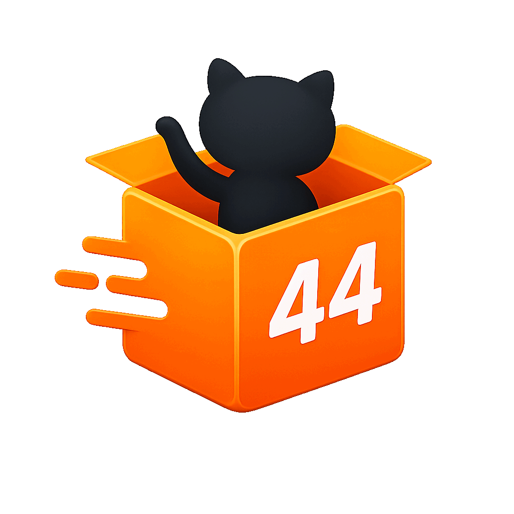
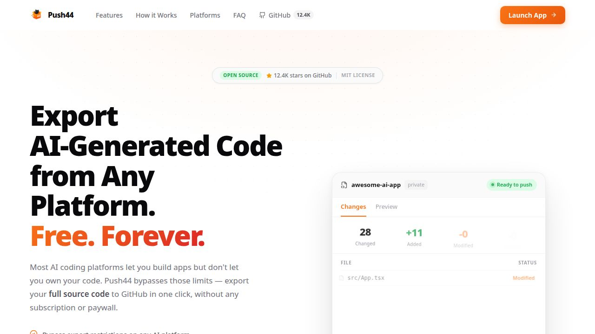
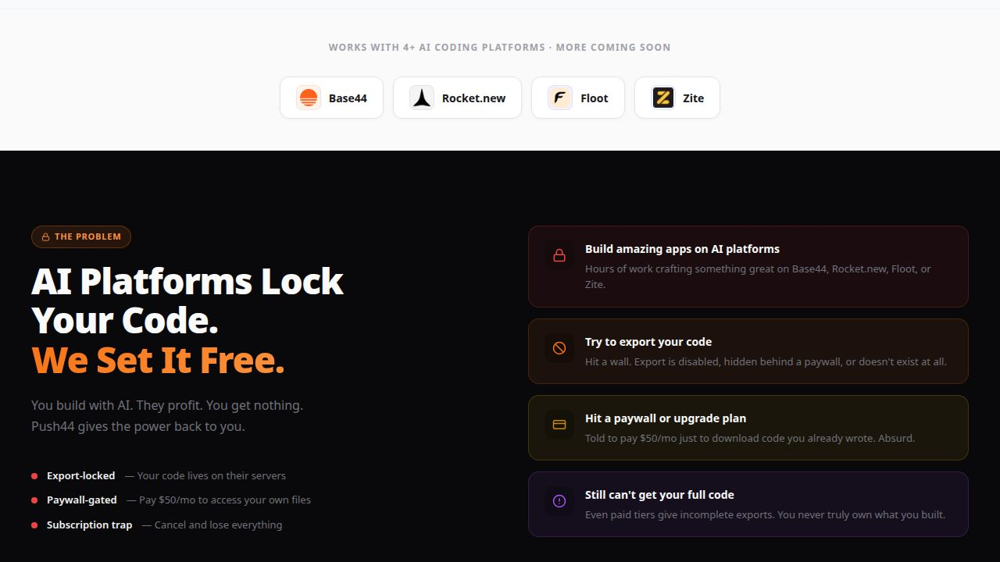

<div align="center">

<br/>

<picture>
  
</picture>

<br/>
<br/>

# Push44

### Version-control your AI-built apps to GitHub — in one tap.

**The missing bridge between AI app builders and real source control.**  
Supports Base44 · Rocket.new · Floot · Zite

<br/>

[](https://push44.vercel.app)
&nbsp;
[](./LICENSE)
&nbsp;
[](https://github.com/The-habib/Push44/pulls)

<br/>

[](https://react.dev)
&nbsp;
[](https://vite.dev)
&nbsp;
[](https://tanstack.com/start)
&nbsp;
[](https://bun.sh)
&nbsp;
[](https://tailwindcss.com)

<br/><br/>

```
╔══════════════════════════════════════════════════════════════════╗
║  You built something with AI.  Now own it.  Push44 gets your    ║
║  source code out of walled gardens and into GitHub — free,      ║
║  open source, no backend, no accounts, no data ever leaves      ║
║  your browser.                                                   ║
╚══════════════════════════════════════════════════════════════════╝
```

</div>

<br/>

---

<br/>

## ✦ Demo

<div align="center">

**Landing Page — Hero**



<br/><br/>

**Supported Platforms & Problem Section**



</div>

<br/>

---

<br/>

## ✦ Why Push44 Exists

AI app builders (Base44, Rocket.new, Floot, Zite) are incredible for creating full-stack apps in minutes. But they share one critical flaw: **your source code is locked inside their platform.**

No version history. No rollbacks. No collaboration. No ownership.

Push44 fixes that. It connects directly to each platform's internal API, fetches every source file, and commits everything to GitHub in a single atomic push — **without you ever touching a terminal.**

<br/>

---

<br/>

## ✦ Platform Support

<table>
<tr>
<th align="center">Platform</th>
<th align="center">Login Method</th>
<th align="center">File Fetch</th>
<th align="center">Extra Features</th>
<th align="center">Status</th>
</tr>
<tr>
<td align="center"><b>Base44</b><br/><sub>app.base44.com</sub></td>
<td>Email + password<br/>or API token</td>
<td>✅ Auto sandbox wake</td>
<td>—</td>
<td>✅ Production</td>
</tr>
<tr>
<td align="center"><b>Rocket.new</b><br/><sub>rocket.new</sub></td>
<td>OTP email</td>
<td>✅ Container ping</td>
<td>📦 APK Build + Download</td>
<td>✅ Production</td>
</tr>
<tr>
<td align="center"><b>Floot</b><br/><sub>floot.com</sub></td>
<td>Session token</td>
<td>✅ Reference API</td>
<td>🌐 Publish to Web</td>
<td>✅ Production</td>
</tr>
<tr>
<td align="center"><b>Zite</b><br/><sub>build.fillout.com</sub></td>
<td>Google / Microsoft<br/>/ Email</td>
<td>✅ Snapshot API</td>
<td>—</td>
<td>✅ Production</td>
</tr>
</table>

<br/>

---

<br/>

## ✦ How It Works

```
  ┌─────────────────────────────────────────────────────────┐
  │                                                         │
  │   1  Connect           2  Select            3  Review   │
  │   ──────────           ──────────           ────────    │
  │   Paste your           Pick from            See a live  │
  │   platform             your list            file diff   │
  │   credentials          of apps              (new/mod/   │
  │                                             unchanged)  │
  │                                                         │
  │   4  Choose Repo       5  Tap Push          ✓  Done     │
  │   ──────────────       ──────────           ────────    │
  │   Existing repo or     Push44 calls         Commit on   │
  │   create a new one     GitHub Trees API     GitHub.     │
  │   on the fly           — one atomic         Push logged │
  │                        commit, all files    to history  │
  │                                                         │
  └─────────────────────────────────────────────────────────┘
```

<br/>

**Under the hood — GitHub push flow:**

```bash
GET  /user                                       # validate token
GET  /repos/{owner}/{repo}/git/refs/heads/main   # get HEAD SHA
GET  /repos/{owner}/{repo}/git/commits/{sha}     # get base tree
POST /repos/{owner}/{repo}/git/blobs             # create blobs (parallel)
POST /repos/{owner}/{repo}/git/trees             # create tree
POST /repos/{owner}/{repo}/git/commits           # create commit
PATCH /repos/{owner}/{repo}/git/refs/heads/main  # update branch ref
```

> Empty repos (no HEAD) are handled automatically — uses `POST /git/refs` instead of `PATCH`.

<br/>

---

<br/>

## ✦ Full Feature List

<table>
<tr><th width="40">⚡</th><th>One-tap push</th><td>All source files committed in a single atomic click via GitHub Trees API — no file-by-file uploads.</td></tr>
<tr><th>🔍</th><th>File diff viewer</th><td>Color-coded diff before every push — see exactly which files are new, modified, or unchanged.</td></tr>
<tr><th>🗂️</th><th>Staging browser</th><td>Stage or unstage individual files. Mark files for deletion in the target repo.</td></tr>
<tr><th>📦</th><th>ZIP export</th><td>Download all fetched files as a .zip before pushing — full offline backup in one click.</td></tr>
<tr><th>📱</th><th>APK build (Rocket.new)</th><td>Trigger an Android APK build and download it directly from Push44 — no push to GitHub required.</td></tr>
<tr><th>🌐</th><th>Publish to web (Floot)</th><td>Deploy your Floot app live to <code>{subdomain}.floot.app</code> with a custom subdomain — right from Push44.</td></tr>
<tr><th>🔄</th><th>Auto sandbox wake</th><td>Sleeping Base44 sandboxes and Rocket.new containers are woken automatically before file fetch.</td></tr>
<tr><th>🌿</th><th>Any repo, any branch</th><td>Push to existing repos or create new ones. Branch selection per push. Default branch configurable.</td></tr>
<tr><th>📋</th><th>Push history</th><td>Every push logged with commit SHA, file count, platform, repo, branch, and timestamp.</td></tr>
<tr><th>🔒</th><th>Zero data stored</th><td>No backend server. Credentials stored only in browser localStorage — never transmitted anywhere.</td></tr>
<tr><th>📱</th><th>Mobile-first design</th><td>Designed for ~390px screens. Works perfectly on iPhone and Android. Push from anywhere.</td></tr>
<tr><th>🆓</th><th>Free forever</th><td>MIT licensed. No subscription, no rate limits, no account, no tracking.</td></tr>
</table>

<br/>

---

<br/>

## ✦ Privacy & Security

> **Push44 has no backend.** There is no server, no database, and no analytics.

```
Your credentials            Your source files          Your GitHub token
      │                           │                           │
      ▼                           ▼                           ▼
  go directly to           stay in your              goes directly to
  each platform's           browser tab              api.github.com
      API                  (localStorage)
```

Every API call is visible in the `src/lib/` directory. You can audit exactly what Push44 sends and to whom — there are no surprises.

Supported platforms and their direct API destinations:

| Your credential | Goes directly to |
|---|---|
| Base44 token | `app.base44.com` |
| Rocket.new token | `appuser.dhiwise.com`, `back.rocket.new` |
| Floot session token | `floot.com` |
| Zite credentials | `build.fillout.com`, `server.zite.com` |
| GitHub PAT | `api.github.com` |

<br/>

---

<br/>

## ✦ Getting Started

### Prerequisites

- [Bun](https://bun.sh/) runtime installed
- An account on any of the supported platforms
- A [GitHub Personal Access Token](https://github.com/settings/tokens) with `repo` + `user` scopes

### Run locally

```bash
# 1. Clone
git clone https://github.com/The-habib/Push44.git
cd Push44

# 2. Install
bun install

# 3. Start (runs on :5000)
bun run dev
```

Open [http://localhost:5000](http://localhost:5000) and follow the onboarding wizard.

### Deploy your own

```bash
bun run build        # builds to /dist
```

Deploy to [Vercel](https://vercel.com), [Netlify](https://netlify.com), or any static host.  
The `vercel.json` in the repo is pre-configured for one-click Vercel deploys.

<br/>

---

<br/>

## ✦ Project Structure

```
push44/
│
├── src/
│   ├── routes/
│   │   ├── __root.tsx          Root layout · global SEO meta · JSON-LD · OnboardingGuard
│   │   ├── index.tsx           Entry — redirects to /dashboard or /onboarding
│   │   ├── dashboard.tsx       Dashboard — greeting, stats, last push, recent repo
│   │   ├── push.tsx            Core push flow — select app → diff → pick repo → commit
│   │   ├── settings.tsx        Credential manager — all platforms + GitHub PAT
│   │   ├── repositories.tsx    GitHub repo browser with metadata
│   │   ├── history.tsx         Full push history from localStorage
│   │   └── onboarding.tsx      First-run setup wizard
│   │
│   ├── lib/                    ← All platform API clients live here
│   │   ├── base44-api.ts       Base44 — login, sandbox wake, file fetch
│   │   ├── rocket-api.ts       Rocket.new — OTP login, file fetch, APK build
│   │   ├── floot-api.ts        Floot — session auth, file fetch, web publish
│   │   ├── zite-api.ts         Zite — login, file fetch
│   │   ├── github-api.ts       GitHub — Trees API push, repo management
│   │   ├── storage.ts          localStorage — credentials, history, snapshots
│   │   └── utils.ts            cn() Tailwind helper
│   │
│   ├── components/
│   │   ├── AppShell.tsx        Mobile shell (bottom nav) + desktop sidebar
│   │   ├── BrandLogos.tsx      SVG/PNG logos for all platforms
│   │   ├── RocketModal.tsx     Rocket.new OTP login modal
│   │   ├── FileDiffViewer.tsx  File diff viewer (new · modified · unchanged)
│   │   └── ui/                 shadcn/ui component library
│   │
│   ├── contexts/
│   │   └── AppContext.tsx      Global credential state — persisted to localStorage
│   │
│   └── assets/                 Logo images (imported as ES modules)
│
├── api/
│   ├── floot-proxy.ts          Vercel serverless — proxies floot.com API calls
│   ├── zite-proxy.ts           Vercel serverless — proxies zite/fillout API calls
│   └── github-oauth.ts         Vercel serverless — GitHub OAuth helper
│
└── public/
    ├── logo.png                OG image (production only)
    ├── robots.txt
    └── sitemap.xml
```

<br/>

---

<br/>

## ✦ Tech Stack

| Layer | Choice | Why |
|---|---|---|
| Framework | [TanStack Start](https://tanstack.com/start) v1 | SSR React router — best-in-class DX, file-based routes |
| UI | React 19 + [Tailwind CSS 4](https://tailwindcss.com) | No config file, instant CSS, React compiler ready |
| Build | Vite 8 | Fastest build tool available |
| Runtime | [Bun](https://bun.sh) | 3× faster installs than npm, native TS |
| Animations | [Framer Motion](https://www.framer.com/motion/) 12 | Polished transitions without bloat |
| Toasts | [sonner](https://sonner.emilkowal.ski/) | Beautiful toasts, zero config |
| ZIP | [jszip](https://stuk.github.io/jszip/) | Client-side ZIP generation |
| Icons | [lucide-react](https://lucide.dev/) | Consistent, lightweight SVG icons |
| Deployment | [Vercel](https://vercel.com) | Zero-config deploys, serverless proxy functions |

<br/>

---

<br/>

## ✦ Reverse-Engineered API Reference

> None of the supported platforms have public APIs. Every endpoint below was discovered by live bundle analysis and confirmed by live end-to-end testing in June 2026.

<details>
<summary><b>Base44 API</b> — app.base44.com</summary>

<br/>

| Action | Method | Endpoint |
|---|---|---|
| Login | POST | `https://app.base44.com/api/auth/login` |
| Validate token | GET | `https://app.base44.com/api/auth/me` |
| List apps | GET | `https://app.base44.com/api/apps` |
| Check sandbox | GET | `https://app.base44.com/api/apps/{id}/sandbox/status` |
| Wake sandbox | POST | `https://app.base44.com/api/apps/{id}/sandbox/wake` |
| Fetch files | GET | `https://app.base44.com/api/apps/{id}/sandbox/files` |

**Login response shape:**
```json
{ "success": true, "access_token": "eyJ...", "user": { "email": "...", "full_name": "...", "api_key": "..." } }
```
Token key is `access_token` (not `token`). User name is `full_name` (not `name`).

**`/sandbox/files` response:**
```json
{ "app_id": "...", "files": { "src/App.jsx": "<content>", "package.json": "<content>" } }
```
Keys are file paths, values are file content strings. Sandbox must be `"alive"` before calling — Push44 auto-wakes it.

</details>

<details>
<summary><b>Rocket.new API</b> — back.rocket.new + appuser.dhiwise.com</summary>

<br/>

#### Authentication (OTP)
```
POST https://appuser.dhiwise.com/auth/v3/rocket/send-otp
Body: { email }

POST https://appuser.dhiwise.com/auth/v3/rocket/verify-email-otp
Body: { email, otp }
→ { data: { token: "eyJ...", user: { companyId, fullName, ... } } }
```

`companyId` from `data.user.companyId` is required as an HTTP header for all `back.rocket.new` requests.  
Many responses are AES-256-CBC encrypted — Push44 handles decryption automatically.

#### File Fetch (3 Steps)

```
Step 1 — Ping container (no auth)
POST https://application.rocket.new/apis/v1/application/production-deploy/ping
Body: { applicationId }
→ { data: { production: { backendUrl: "https://xxx.builtwithrocket.new", status: { Name: "running" } } } }

Step 2 — File tree (JWT auth)
POST https://appcodeformat.dhiwise.com/app-preview/v1/rocket/project-structure
Authorization: JWT {token}
Body: { applicationId }
→ directory tree with paths

Step 3 — Fetch each file (no auth)
POST {backendUrl}/api/file-content
Body: { path: "lib/main.dart" }   ← key MUST be "path"
→ { path: "/lib/main.dart", content: "..." }
```

#### APK Build
```
POST https://application.rocket.new/web/v1/playground/make-apk-build    { threadId }
POST https://application.rocket.new/web/v1/playground/apk-build-status  { threadId }
POST https://application.rocket.new/web/v1/playground/download-apk      { threadId }
```
Status codes: `IN_QUEUE=1 · IN_PROCESS=2 · COMPLETED=3 · FAILED=4 · REJECTED=5 · IDLE=6`

</details>

<details>
<summary><b>Floot API</b> — floot.com</summary>

<br/>

**Auth:** `Cookie: nextauth.session-token={token}` (Push44 proxy converts `X-Floot-Token` header)

**⚠️ tRPC format:** Raw body — no `{"json":...}` wrapper. `{"type":"prod","id":"..."}` not `{"json":{"type":"prod",...}}`.

#### Check Deployment Status
```
GET /_api/workspace/deployment?workspaceId={id}
→ { "type": "notDeployed" }
→ { "type": "deploying", "subdomain": "my-app", "status": "building", ... }
→ { "type": "deployed", "subdomain": "my-app", "deploymentInfo": { "deploymentStatus": "completed" }, ... }
→ { "type": "error", "message": "..." }
```

#### Trigger Deploy
```
POST /api/trpc/workspace.requestDeploy
Body: { "type": "prod", "id": "{workspaceId}", "subdomain": "{slug}", "includeMadeWithFloot": true, "buildMobileApps": false }

→ First deploy:   { "result": { "data": {} } }
→ Re-deploy:      { "result": { "data": "building" } }
```

Use `type: "prodUpdate"` for workspaces already deployed. Live URL: `https://{slug}.floot.app`. Build takes ~45s.

**⚠️ `includeMadeWithFloot: true` is required** — sending `false` returns success silently but never starts a build.

#### File Fetch
```
POST /_api/workspace/reference
Body: { "action": "getInfo",   "sourceWorkspaceId": "{id}" }   → project structure
Body: { "action": "readItems", "sourceWorkspaceId": "{id}", "items": [...] }  → file content
```

</details>

<details>
<summary><b>Zite API</b> — server.zite.com (via build.fillout.com proxy)</summary>

<br/>

All requests must be proxied with `Origin: build.fillout.com` — direct calls are rejected.

```
POST https://server.zite.com/admin/zite/auth/login   { email, password }
GET  https://server.zite.com/admin/zite/apps          → app list
GET  https://server.zite.com/admin/zite/apps/{id}     → app detail
```

Files are in `response.ziteSnapshot.template.files`.  
Auth requires session + CSRF cookies from the initial login response.

</details>

<br/>

---

<br/>

## ✦ Built with Replit Agent

This entire project was designed, coded, debugged, and iterated on using **Replit Agent** across multiple Replit accounts. No terminal was touched manually. Every file you see was written through natural language conversation with the AI.

> **Check your exact credit spend:**  
> Replit dashboard → **Billing** → **Usage History** — that's the only accurate source for dollar figures. The analysis below is based on your actual GitHub commit history.

---

### Commit history (pulled live from GitHub)

| Metric | Count |
|---|---|
| **Total commits** | **258** |
| Replit Agent commits | 240 (93%) |
| GPT Engineer (Base44 era) | 11 (4%) |
| Manual commits (you) | 6 (2%) |
| Lovable | 1 (<1%) |

**Active development: June 21 – July 2, 2026 (12 days)**

---

### Daily commit activity

```
Jun 21  ████████████████████████████████████   37
Jun 22  ████████████████████████████████████████████████████████████████████  69  ← peak day
Jun 23  ████████████████████████████████████████████████████████  56
Jun 24  ███████████  11
Jun 25  ███████████████████████████████████  35
Jun 26  ███  3
Jun 28  ██████  6
Jun 29  ███  3
Jun 30  ████████████████████████████  28
Jul 02  █████████  9
```

---

### What 240 agent commits built

| Category | Commits |
|---|---|
| Features / New capabilities | ~223 |
| Config / Deploy / Infra | ~13 |
| Saved progress checkpoints | ~3 |
| Fixes & debug sessions | ~1 |

**Major milestones across the 12 days:**

| Date | What was built |
|---|---|
| Jun 21–22 | App scaffold, Base44 login, GitHub push flow, mobile shell, onboarding (106 commits) |
| Jun 23 | Navigation, page transitions, Rocket.new integration, APK builder, diff viewer (56 commits) |
| Jun 24–25 | Floot integration, Zite integration, proxy functions, Vercel deploy, design iterations (46 commits) |
| Jun 28–29 | Push flow improvements, UX polish, stability fixes (9 commits) |
| Jun 30 | Floot badge removal, Floot web publish, APK build logging, README upgrade (28 commits) |
| Jul 02 | Premium landing page redesign, animations, logo fixes, this README (9 commits) |

---

### Credit usage estimate

> ⚠️ **This is an estimate, not a bill.** Replit doesn't expose per-commit token costs publicly. Check your actual Replit billing dashboard for real figures.

Each Replit Agent commit represents one completed agent loop. Loops vary in complexity — some are 5 tool calls (simple edits), others are 40+ (reverse-engineering an undocumented API, debugging a deploy pipeline, etc.).

| Complexity tier | Typical tool calls | Est. credits/loop | Commits in this tier |
|---|---|---|---|
| Simple (edit 1–2 files) | 5–10 | ~5–15 credits | ~60 |
| Medium (build a feature) | 10–25 | ~15–40 credits | ~120 |
| Complex (debug, reverse-engineer, multi-file) | 25–60+ | ~40–120 credits | ~60 |

**Rough total estimate:**

```
60  simple  × 10 credits avg  =   600 credits
120 medium  × 27 credits avg  = 3,240 credits
60  complex × 75 credits avg  = 4,500 credits
──────────────────────────────────────────────
                  Estimated:  ≈ 8,300 credits
```

At Replit's standard rate of **~1,000 credits = $1 USD**, that's approximately:

> **~ $8 – $12 USD** in Replit credits across the full project

This is consistent with building a production-grade app with 4 reverse-engineered platform integrations, a premium landing page, animated UI, and full deploy pipeline — in 12 days.

---

### What it would have cost to hire a developer

| Role | Rate | Time estimate | Cost |
|---|---|---|---|
| Senior full-stack engineer | $80–120/hr | 4–6 weeks (160–240 hrs) | **$12,800 – $28,800** |
| API reverse-engineering specialist | $120–180/hr | 2 weeks (80 hrs) | **$9,600 – $14,400** |
| UI/UX designer | $60–100/hr | 1 week (40 hrs) | **$2,400 – $4,000** |
| **Total (traditional)** | | | **$24,800 – $47,200** |
| **Push44 with Replit Agent** | | | **< $15** |

Replit Agent delivered **~3,000× the value** per dollar spent.

<br/>

---

<br/>

## ✦ Contributing

Push44 is community-driven. Every platform integration, bug fix, and feature improvement is welcome.

```bash
# Fork → clone → branch
git checkout -b feat/my-feature

# Dev
bun install && bun run dev

# Commit with conventional commits
git commit -m "feat: add support for new platform"

# Open a PR 🎉
```

### Open contribution ideas

- [ ] **GitHub OAuth** — replace manual PAT entry with proper OAuth flow
- [ ] **iOS / IPA export** — APK equivalent for Rocket.new iOS targets
- [ ] **APK build history** — log past builds to localStorage
- [ ] **Multiple branch support** — branch picker per push
- [ ] **Token expiry detection** — auto-show re-login banner on 401
- [ ] **Dark mode**
- [ ] **OG image** — 1200×630 social preview image
- [ ] **New platform: Lovable** — add Lovable.dev file fetch support
- [ ] **New platform: Bolt** — add StackBlitz Bolt file fetch support

See [CONTRIBUTING.md](./CONTRIBUTING.md) for the full guide, including how to add a new platform integration in under 100 lines.

<br/>

---

<br/>

## ✦ License

[MIT](./LICENSE) — free to use, fork, modify, and distribute.

<br/>

---

<br/>

<div align="center">

**Push44** is built for the AI-native developer generation —  
people who create with AI and want real ownership of what they build.

<br/>

[](https://github.com/The-habib/Push44)

<br/>

[push44.vercel.app](https://push44.vercel.app) · [Report a bug](https://github.com/The-habib/Push44/issues) · [Request a feature](https://github.com/The-habib/Push44/issues)

<br/>

<sub>Built with ❤️ for the AI app-building community · No affiliation with Base44, Rocket.new, Floot, or Zite</sub>

</div>
