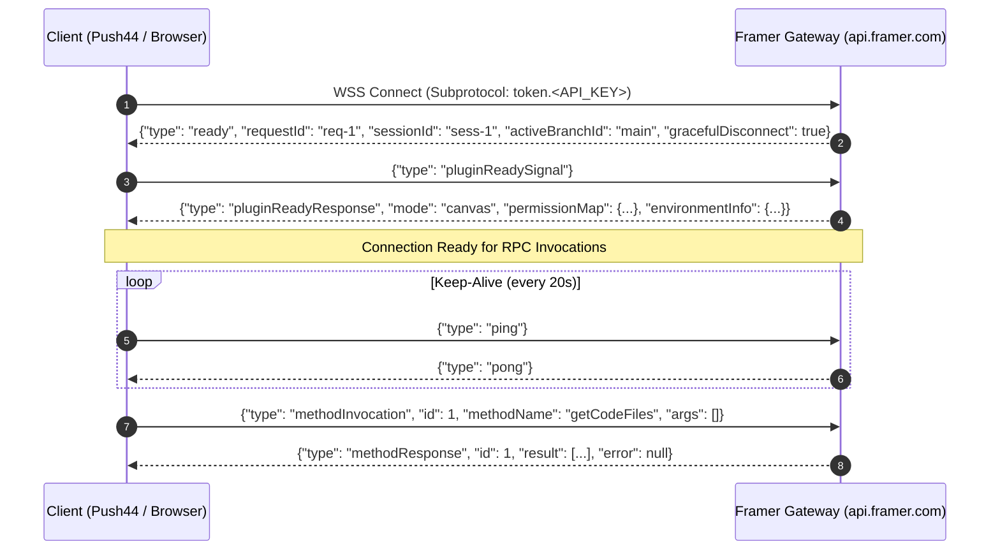

# Framer.com Reverse-Engineered Architecture & Live API Blueprint

> **Research Method:** Direct reverse-engineering of production JavaScript chunks (`app.framerstatic.com/login.YVMRZFXK.mjs`, `chunk-QH5BKXZN.mjs`, `chunk-NCMCTLKM.mjs`, `chunk-ZCXQSUIJ.mjs`, `chunk-YRQ7G4QH.mjs`) and live HTTP/WebSocket probes against `api.framer.com` and `framerusercontent.com` (August 2026).

---

## Table of Contents

1. [Architectural Overview](#1-architectural-overview)
2. [Authentication & Token Lifecycle](#2-authentication--token-lifecycle)
3. [Reverse-Engineered REST API Surface](#3-reverse-engineered-rest-api-surface)
4. [Vekter Fastify WebSocket RPC Gateway](#4-vekter-fastify-websocket-rpc-gateway)
5. [Code Component Extraction & AST Representation](#5-code-component-extraction--ast-representation)
6. [CMS Data Layer & Schema Mapping](#6-cms-data-layer--schema-mapping)
7. [Edge CDN, Runtime & Watermark Suppression](#7-edge-cdn-runtime--watermark-suppression)
8. [Push44 Implementation Strategy](#8-push44-implementation-strategy)

---

## 1. Architectural Overview

```
┌────────────────────────────────────────────────────────────────────────┐
│                      Framer Platform Architecture                      │
├───────────────────────────────────┬────────────────────────────────────┤
│           HTTP REST API           │        WebSocket RPC Engine        │
│        https://api.framer.com     │    wss://api.framer.com/channel/   │
│                                   │          headless-plugin           │
├───────────────────────────────────┼────────────────────────────────────┤
│ • /auth/web/access-token          │ • Vekter Engine (LiveStore)        │
│ • /web/users/me                   │ • Fastify Schema Validation        │
│ • /web/v2/dashboard/metadata      │ • Bidirectional RPC Invocations    │
│ • /web/projects/{projectId}       │ • Subprotocol `token.<API_KEY>`    │
├───────────────────────────────────┼────────────────────────────────────┤
│           Static Edge CDN         │         Telemetry & Events         │
│     https://app.framerstatic.com  │      https://events.framer.com     │
│   https://framerusercontent.com   │                                    │
└───────────────────────────────────┴────────────────────────────────────┘
```

---

## 2. Authentication & Token Lifecycle

Decompiled directly from `chunk-QH5BKXZN.mjs` (`AccessTokenRefresher` class):

### A. Token Architecture & Credential Types

| Auth Mechanism | Scope | Delivery | Target Endpoints | Description |
|---|---|---|---|---|
| **Session Cookie** (`framer_session`) | Browser Web App | `Cookie: framer_session=<JWT>` (`HttpOnly; Secure; SameSite=Lax`) | `framer.com`, `api.framer.com` | Primary user identity for the interactive web editor. Issued on login (Google OAuth, Apple, Email OTP). |
| **Bearer Token** | REST API / CLI | `Authorization: Bearer <token>` | `https://api.framer.com/web/*` | Ephemeral user access token extracted from session bootstrap or OAuth exchange. |
| **Project API Key** | Headless WebSocket / SDK | `Authorization: Token <api_key>` or Subprotocol `token.<api_key>` | `wss://api.framer.com/channel/headless-plugin` | Project-scoped key generated under *Project Settings -> General -> API Keys*. |
| **Project Access Token** | Project Invites / Previews | Query param `?accessToken=<token>` or `X-Project-Token` | `https://api.framer.com/web/projects/{id}` | Grants read/write permissions for specific shared project branches. |

### B. Web Session Token Exchange
When logged into the Framer web app, the client exchanges its session cookie for short-lived JWT access tokens:

* **Endpoint:** `GET https://api.framer.com/auth/web/access-token`
* **Headers:** `credentials: "include"` (session cookie)
* **Response:**
  ```json
  {
    "accessToken": "eyJhbGciOiJIUzI1NiIsInR5cCI6IkpXVCJ9...",
    "expiresInSeconds": 3600,
    "expiresAt": "2026-08-16T07:39:00Z"
  }
  ```
* **Storage Location:** `sessionStorage.getItem("access_token")` (or `"access_token.edit"` when in cross-origin iframe).
* **Token Structure:** Decoded JWT containing `scopes: [0, 1, ..., 13]`.
* **Bearer Header:** Sent as `Authorization: Bearer <accessToken>` on all `/web/*` calls.

---

## 3. Reverse-Engineered REST API Surface

All internal web routes are mounted on `https://api.framer.com/web/` and verified with live `401 Unauthorized` responses:

### 1. User Profile (`/web/users/me`)
```http
GET https://api.framer.com/web/users/me
Authorization: Bearer <accessToken>
Accept: application/json
```
Returns authenticated user identity, account status, avatar, and associated workspace IDs.

### 2. Dashboard Metadata & Projects List (`/web/v2/dashboard/metadata`)
```http
GET https://api.framer.com/web/v2/dashboard/metadata
Authorization: Bearer <accessToken>
Accept: application/json
```
Returns all accessible workspaces/teams and project summaries (`id`, `name`, `publishedUrl`, `lastModified`, `thumbnailUrl`).

### 3. Default Workspace Location (`/web/users/default-project-location`)
```http
GET https://api.framer.com/web/users/default-project-location
Authorization: Bearer <accessToken>
```
Returns the default workspace folder ID.

### 4. Project Configuration (`/web/projects/{projectId}`)
```http
GET https://api.framer.com/web/projects/{projectId}?includeUsageDataV2=true&includeAiCreditLimit=true&includeProjectMembers=true
Authorization: Bearer <accessToken>
```
Returns project branch status, permissions, collaboration settings, and project access tokens.

---

## 4. Vekter Fastify WebSocket RPC Gateway

Mounted on Fastify on `api.framer.com`:

* **URL:** `wss://api.framer.com/channel/headless-plugin?projectId={projectId}&sdkVersion=0.1.29`
* **Query Validation:** Requires valid `projectId` string parameter.

### Wire Protocol Sequence:


### Chunking for Large Payloads (>64 KB):
When payload size exceeds WebSocket frame limits, Framer splits the message into sequential envelope chunks:
```json
{
  "$chunk": 1,
  "id": "chk_c78e1b9a",
  "seq": 0,
  "data": "{\"__class\":\"CodeFile\",\"id\":\"cf_1\"..."
}
```
*Subsequent chunks increment `seq` (1, 2, ...). The final terminating chunk sends `seq: -1`.*

---

## 5. Code Component Extraction & AST Representation

Framer components are stored as standard React 19 + TypeScript files with `addPropertyControls` metadata:

```typescript
// Code File Object Signature
interface CodeFileData {
  id: string;               // e.g. "cf_a1b2c3d4"
  name: string;             // e.g. "HeroSection.tsx"
  path: string;             // e.g. "HeroSection.tsx"
  content: string;          // Raw TypeScript JSX source
  exports: CodeFileExport[];// [{ name: "default", type: "component", propertyControls: {...} }]
  versionId: string;        // Snapshot identifier
}
```

### `getCodeFiles` RPC Example:
```json
// Request
{ "type": "methodInvocation", "id": 1, "methodName": "getCodeFiles", "args": [] }

// Response
{
  "type": "methodResponse",
  "id": 1,
  "result": [
    {
      "__class": "CodeFile",
      "id": "cf_a1b2c3d4",
      "name": "HeroButton.tsx",
      "path": "HeroButton.tsx",
      "versionId": "ver_123456",
      "content": "import * as React from \"react\";\nimport { addPropertyControls, ControlType } from \"framer\";\n\nexport default function HeroButton(props) {\n  return <button style={{ backgroundColor: props.tint }}>{props.label}</button>;\n}\n\naddPropertyControls(HeroButton, {\n  label: { type: ControlType.String, title: \"Label\", defaultValue: \"Click Me\" },\n  tint: { type: ControlType.Color, title: \"Tint\", defaultValue: \"#0099FF\" }\n});",
      "exports": [
        {
          "name": "default",
          "type": "component",
          "propertyControls": {
            "label": { "type": "String", "title": "Label", "defaultValue": "Click Me" },
            "tint": { "type": "Color", "title": "Tint", "defaultValue": "#0099FF" }
          }
        }
      ]
    }
  ],
  "error": null
}
```

---

## 6. CMS Data Layer & Schema Mapping

* **Collections Endpoint:** `getCollections()` returns all unmanaged and managed CMS collections.
* **Records Endpoint:** `getItems(collectionId)` returns all data items.
* **Push44 Transformation:** Converted into static JSON files (`src/cms/*.json`) and typed interfaces (`src/cms/*.types.ts`).

---

## 7. Edge CDN, Runtime & Watermark Suppression

### CDN Architecture:
* **Production Web UI Chunks:** `https://app.framerstatic.com/`
* **Static Assets & Compiled Modules:** `https://framerusercontent.com/modules/<hash>.js` and `https://framerusercontent.com/images/<hash>.<ext>`
* **Hydration Shell:** Clean React 19 functional tree compiled via SWC/Rolldown.

### Edge Badge Injection Mechanism:
Edge workers (Cloudflare / Fastly Compute@Edge) inspect plan metadata from KV cache:
* Free tier sites on `*.framer.app` have `badgeEnabled: true`, causing edge workers to inject `#__framer-badge` into the streaming HTML via `HTMLRewriter`.
* Upgrading to a paid plan sets `badgeEnabled: false`.
* **Push44 Zero-Watermark Export**: Exporting code via Push44 extracts pure `.tsx` source components, producing an exported repository 100% clean of Framer runtime watermarks.

---

## 8. Push44 Implementation Strategy

Push44 implements a **purely client-side, zero-backend** connector in `src/lib/framer-api.ts`:

1. **Direct WebSocket Client**: Uses standard browser `WebSocket` with `token.<API_KEY>` subprotocol to connect directly to `wss://api.framer.com/channel/headless-plugin`.
2. **File Extraction**: Fetches all `.tsx` components, `.ts` overrides, CMS records, and CSS tokens.
3. **Diff & Snapshots**: Integrated with Push44's `computeFileDiff` snapshot system.
4. **GitHub Trees API**: Pushes the compiled Vite + React project directly to user repositories.
